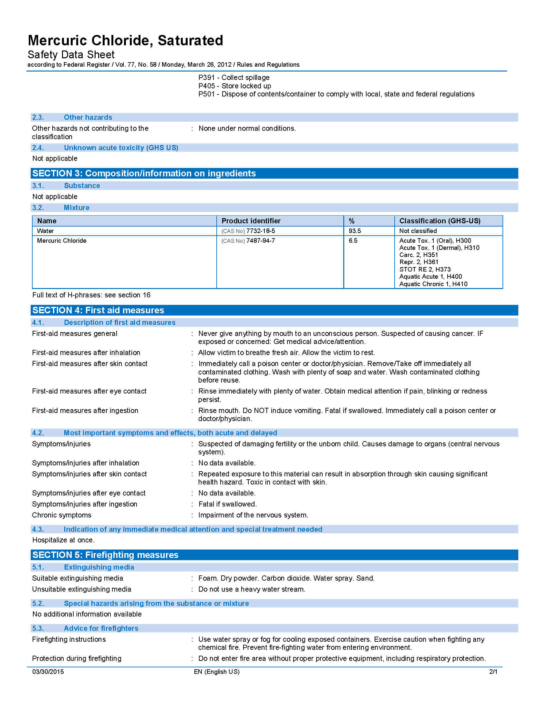
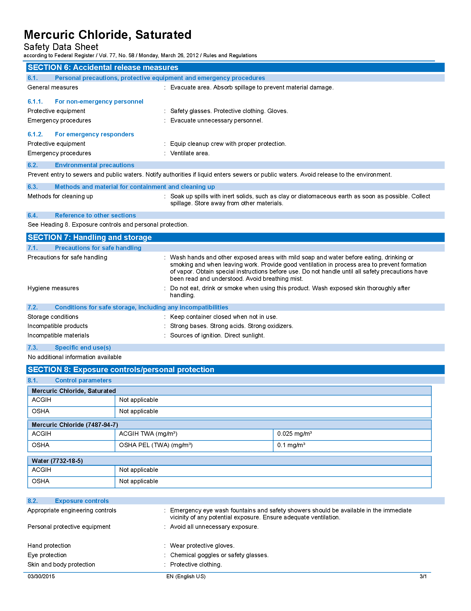
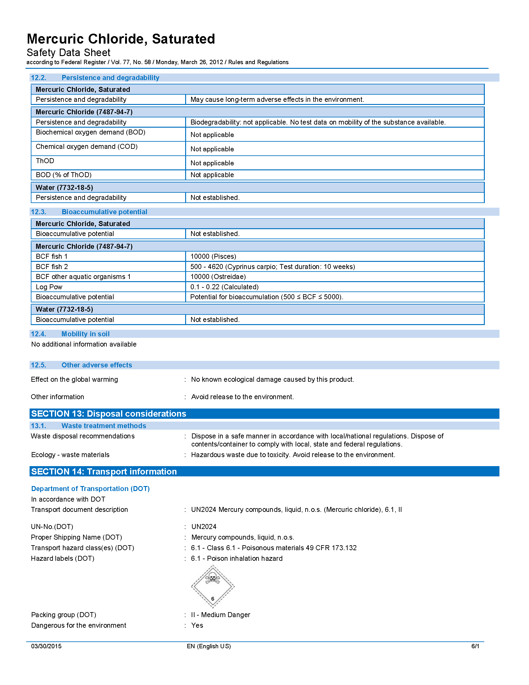

# CTD and DIC Water Sampling Field Guide {#water}

If available hands on deck and conditions allow, please conduct the CTD downcast and the water sample collection simultaneously.

## Waypoint and metadata collection

Use the OCC provided GPS unit to collect a waypoint when the CTD downcast begins. Record all metadata on provided data sheet.

## CTD CAST

1. Ensure that the CTD line is connected to the top of the CTD frame by 1 shackles.
2. Tie non-CTD end of the CTD line to the boat with a bowline or clip off with carabiner.
3. Flake CTD line on deck.
4. When the coxswain says the CTD can go over the side, raise the CTD switch to the &quot;ON &quot; position, and loudly say, &quot;ON!&quot; then lower it over the side until the top of the frame is 1 meter below the surface of the water to begin the 1 minute soaking period, either holding the line or cleating off the line to maintain the CTD at soaking depth.
5. After 1 minute soak, ask the coxswain for the current depth so you know how far you can lower the CTD without it hitting the bottom (5-10 feet less line than the bottom depth).  Un-cleat the CTD line if it was cleated and begin the CTD cast by pulling the CTD frame up until the top ring of the frame emerges from the water, then begin gradually lowering at a consistent rate, hand over hand, until the CTD gets to the target depth (using the markings on the line to estimate depth). Once the target depth is reached, pull the CTD back on board.
6. Once the CTD is back on board, lower the switch to &quot;OFF&quot;, and loudly say &quot;OFF!&quot;

## water sample collection

1. Prime the Niskin Bottle, ensuring the petcock and the air bleed valve are closed.
2. Clip off the boat side of the niskin line to the boat.
3. Near the end of the the CTD soaking time, lower the weight and the open Niskin bottle over the side so the top of the Niskin is at 1m depth (surface of water at the BLACK mark drawn on Niskin line).
4. Clip the messenger on to the line
5. When the CTD begins its downcast, send the messenger to trigger the Niskin to close. Ensure no air bubbles are trapped inside the Niskin and bottle sits vertically in the water column before firing the messenger.

## Water sample Processing

1. Designate roles: bottle filler, mercuric chloride (HgCl2) handler, data recorder.  NOTE: Supersaturated mercuric chloride solution is extremely dangerous; use the utmost caution when dealing with the chemical.  All personnel working with it are required to wear eye protection.  The mercuric chloride handler is also required to where disposable nitrile gloves. In the event of contact with any part of the body, wash the area profusely. If contact is made with eyes, abort operations, rinse continuously with fresh water (or salt if fresh has run out), alert the ship and return ASAP.
2. Remove a bottle and its stopper from the storage tote and insert the tygon tubing to the bottom of the bottle. With the tygon tubing attached to the Niskin bottle dispensing nipple, open the Niskin bottle valve and allow for three complete flushings of the bottle to occur before stopping the sample collection (i.e. start the collection and count how long it takes for the bottle to overflow and then allow that to occur for 2x the required fill time...ie. if the bottle fills in 20 seconds, allow the sample water flow to flush the bottle for 60 seconds). Attention must be given to how the sample water enters the bottle. Care should be given to ensure that smooth water flow into the bottle is maintained and that no bubbles are created during the dispensing of sample. Any bubbles introduced to the sample will alter the pCO2 within the sample water and produce inaccurate DIC results.
3. After the appropriate flushing time, shut off the Niskin valve to stop the water flow, while at the same time ensuring the tygon tubing doesn&#39;t come off the bottom of the sample bottle. Once the flow is shut off, pinch the tubing and in one motion remove it from the bottle. This &quot;pinch and remove&quot; action with the tubing should establish a consistent head-space in all the sample bottles. The meniscus of the sample should be about 1 cm below the neck of the bottle (see picture.)
`r knitr::include_graphics(rep("images/BOD_bottle_headspace.png"))`
4.
  a. Once the proper head space is established, pipette 200ul of HgCl2 saturated solution into the sample bottle
  b. Use the syringe containing vacuum grease to make 3-5 vertical &quot;stripes&quot; of grease on a clean, dry stopper. Insert the greased stopper until fully seated in the bottle, then twist until the grease completely seals the bottle contents. The vertical stripes of grease allow for gases to escape the bottle neck while the stopper is being inserted. Having the stopper clean/dry ensures that other than sample water isn&#39;t introduced into the bottle. Twisting the stopper, once it has been fully seated into the neck of the bottle, ensures a smooth distribution of grease within the sample bottle&#39;s neck and an air tight seal.
  c. Use the rubber band and plastic collar to lock down the stopper inside the bottle. Once secured, softly invert the bottle 1-2x to mix the HgCl2 with the water sampleand secure the sample bottle in the field container.
  d. Complete data sheet including REA Site name or OCC Site Name (if it exists), waypoint name (default), UTC date and time, lat and long, sample depth and DIC bottle #.

## Mercuric Chloride Emergency Procedures

* Eyes: Irrigate immediately with large quantity of water for at least 15 minutes.
* Skin: Immediately flush with plenty of water for at least 15 minutes.  Remove any contaminated clothing. 
* Inhalation: Remove to fresh air. If not breathing, give artificial respiration. If breathing is difficult, give oxygen. 
* Ingestion: Only induce vomiting if directed to do so by medical personnel.
* The MSDS can be seen from any NOAA Google Account via [this google drive link](https://drive.google.com/open?id=12w0Kmi8VVE9n_0A5_BhNVq6l4nMDtM1K)

### Mercuric Chloride Safety Data Sheet (SDS)

{width=100%}
{width=100%}
{width=100%}
{width=100%}
{width=100%}
{width=100%}
{width=100%}
{width=100%}
{width=100%}
{width=100%}
